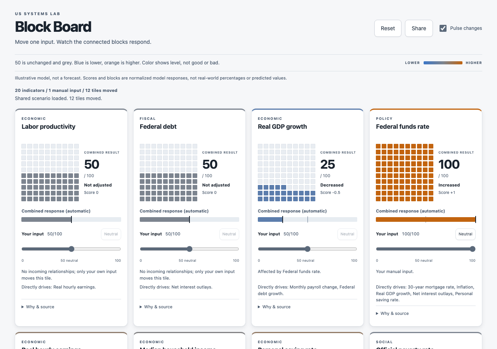
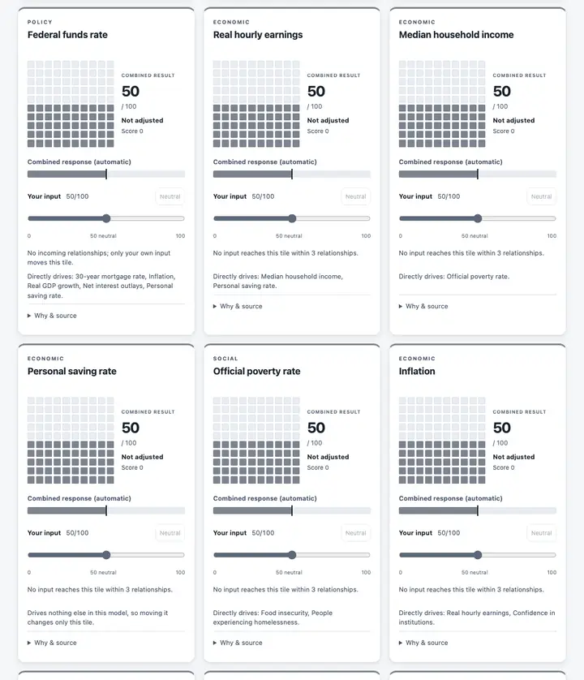
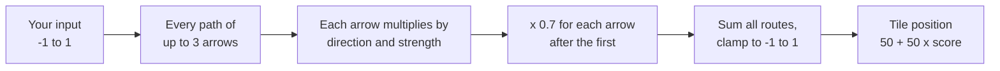

# US Systems Lab

[](https://github.com/codethor0/us-systems-lab/actions/workflows/ci.yml)
[](LICENSE)
[](https://us-systems-lab.codethor0.workers.dev/)

**[Try it live](https://us-systems-lab.codethor0.workers.dev/).** No install, no signup.

An interactive block board of U.S. economic and social indicators. Each indicator is a tile of 100
squares. Move one input and watch the tiles it is connected to gain or lose squares and change color.

<picture>
  <source media="(prefers-color-scheme: dark)" srcset="docs/board-dark.png" />
  
</picture>

> **Read this first.** This is an illustrative model for exploring how systems connect. It is not
> a predictive economic tool and not a forecast. The numbers it propagates are arithmetic on
> hand-assigned weights, not estimates of what would happen if a real policy or event moved a real
> indicator.

## Using the board



- Every tile starts at **50 out of 100** in neutral grey, labeled **Not adjusted**. The 50 is a
  display convention that leaves room to move both up and down. It is not a health rating.
- Set **your input** for a tile with its slider, or click a square. Inputs move in steps of five.
- The squares and the **Model response** bar show the tile's normalized model response: your
  input plus the effects that reach it from other inputs over paths of up to three relationships.
  The bar is continuous; the squares are rounded. Results never feed back in as inputs.
- The line under each title is the **real-world baseline**, the stored figure with its period. It
  never changes with your input. The model response is a position on an editorial 0 to 100 scale,
  not a predicted value of the real indicator.
- Color shows level: grey at 50, blue below, orange above. Blue and orange stay distinguishable
  with the common forms of color blindness. Color does not show worse to better: a higher federal
  debt is not a better one.
- The page follows the system light or dark setting.
- Open **Why & source** on a tile for the paths behind its result, strongest first, with the kind of
  every step; the relationships it belongs to, each labeled by kind, citation status and horizon;
  why it drives nothing, if it is a dead end; and the stored baseline with its source.
- Under a moved tile, one line says how its direction holds up when the two editorial settings
  change. See [Sensitivity](#sensitivity).
- **Show** filters the tiles by category. Hidden tiles still take part in the calculation.
- **Cited relationships only** reruns the same arithmetic on the relationships that carry a
  citation. None do yet, so in this view no input reaches another tile, and each tile says that
  this is a gap in citations, not evidence of no effect. The setting is not part of a Share link:
  links carry inputs only and always open with every relationship.
- **Save as scenario A** keeps the current results in this tab. Change inputs and each tile shows
  scenario A beside the current position. Reset and history navigation change the inputs, not A;
  **Clear A** removes it. Nothing is stored in the address bar, the browser or anywhere else.
- **Reset** returns every tile to 50. **Share** shows a link that reproduces your inputs, and
  **Copy link** copies it.
- Tiles pulse briefly, at most once a second, when their result changes. The checkbox in the header
  and the system reduced-motion setting turn the pulse off without hiding results.

The display position is `50 + 50 x score`, where the score is the model's final result clamped to
-1 to 1. Squares are rounded symmetrically around 50, so scores of +0.25 and -0.25 show 63 and 37
squares. Floating-point noise, such as effects that cancel to 1e-17 instead of 0, is cleaned up
for display only; the model result itself is not changed. A real response smaller than one square
still shows its signed score, in scientific notation if needed, rather than a false zero.

## Sensitivity

The decay of 0.7 and the limit of three relationships are editorial choices. To show how much they
matter, the board reruns every scenario under nine nearby settings: decay 0.5, 0.7 and 0.9, with
paths of up to 2, 3 and 4 relationships. The default is one of the nine. Each moved tile then says
one of three things:

- **Same direction under all 9 tested settings**, with the range of positions if they differ.
- **Moves under some tested settings only**: the effect needs a longer path than some settings
  allow. Poverty's response to the federal funds rate is an example: it needs four relationships.
- **Direction depends on the settings**: routes of different lengths pull opposite ways, and the
  settings decide which wins.

This is an explanation of the model, not a second prediction. The same engine produces every
number; [src/model/analysis.ts](src/model/analysis.ts) only changes its two parameters.

## What moves what

The relationships are one-way. An input moves the indicators downstream of it and never the ones
upstream. Six indicators have no outgoing relationship, so moving their input changes only their
own tile: `food_insecurity`, `hate_crimes`, `homelessness`, `institutional_confidence`,
`payrolls_headline` and `savings_rate`. Each one records why in its `terminal` field, and the
validator rejects a dead end with no stated reason. Four are outcomes the model does not trace
further; for `payrolls_headline` and `savings_rate`, the downstream effects are too noisy or too
contested to model. They still respond when other indicators move, except `hate_crimes`, which has
no relationships at all, on purpose.

Federal borrowing is a loop of two accounting links and one earlier link: interest outlays add to
the deficit and so to debt growth (`net_interest` to `debt_growth_rate`), debt growth adds to the
debt stock (`debt_growth_rate` to `federal_debt`), and a larger stock raises interest outlays
(`federal_debt` to `net_interest`). A path never revisits an indicator, so the loop is counted once
and does not compound. Every tile states what it directly drives. Adding a relationship is a change
to the model and follows the rules in [CONTRIBUTING.md](CONTRIBUTING.md).

## Status

Early. Built and tested: the data model and its validator, a graph with cited starting values, the
propagation logic, the Block Board interface, real-Chrome browser tests, and the repository's
automated checks, including an axe-core scan for WCAG 2.2 A and AA rules in light and dark mode on
every CI run. [DEPLOYMENT.md](DEPLOYMENT.md) records the hosting decision and steps, and
[TESTING.md](TESTING.md) records what each check does and does not establish.

## How to read the labels: empirical and modeled

Every arrow in the graph says that one indicator affects another. Each arrow carries one of two
labels, and the difference between them is the most important thing in this project.

- **Empirical** means a specific, cited source supports that the relationship exists and points in
  that direction. The citation travels with the arrow: a link, a description of the document, and
  the date it was read. Even then, the weight drawn on the arrow is one of four coarse tiers, not a
  measured coefficient. The citation backs the direction, not the size.
- **Modeled** means the direction is commonly argued and plausible, but the relationship is
  contested or has no size that anyone can cite. A modeled arrow carries no source, and the
  interface will not present it as a finding.

An arrow is modeled unless someone supplies a checkable citation. Nothing is promoted because
"everyone knows".

Separately, each arrow records what kind of relationship it asserts, because a citation can support
an association without showing that one thing causes the other:

- **Accounting**: follows from how the measures are defined or added up. Real earnings are nominal
  earnings adjusted for prices, so inflation lowers them unless pay keeps pace.
- **Causal**: a mechanism by which one indicator moves the other, such as policy rates feeding into
  mortgage rates.
- **Association**: the two move together, and the arrow does not claim which causes which.

Each arrow also carries a rough horizon, short, medium or long, because some relationships take
months and others years. The arithmetic ignores both labels; they are there so a reader can judge
each arrow.

The starting value of each indicator has its own, separate label. `primary` means a page at the
primary publisher was read on a stated date and the figure was found on it. `secondary` means a news
page or aggregator relays the figure. `pending` means no source page has been read yet, so no
source is stored. Abstract levers, such as worker bargaining power, sit on an index from 0 to 100 and
have no baseline at all, because there is nothing measured to check.

The graph currently has 20 nodes and 22 edges: 0 empirical and 22 modeled. Every arrow is therefore
an argument today, and none is yet a finding.

## How the arithmetic works

Moving a lever sets a number between -1 and 1, meaning a fraction of an editorial display range for
that indicator. [src/lib/propagation.ts](src/lib/propagation.ts) then walks every path of up to
three arrows from that indicator. Each arrow multiplies the change by its direction (+1 or -1) and
its strength, and every arrow after the first shrinks the change by a decay factor (0.7 by default,
a starting point with no empirical basis). Effects that arrive by different routes add, and the
total for each indicator is clamped to the range -1 to 1.


```mermaid
flowchart LR
  A["Your input<br/>-1 to 1"] --> B["Every path of<br/>up to 3 arrows"]
  B --> C["Each arrow multiplies by<br/>direction and strength"]
  C --> D["x 0.7 for each arrow<br/>after the first"]
  D --> E["Sum all routes,<br/>clamp to -1 to 1"]
  E --> F["Tile position<br/>50 + 50 x score"]
```

The three-arrow limit is visible on the board. Raising the federal funds rate reaches median
household income in three arrows (through inflation and real hourly earnings), so the official
poverty rate, one arrow further, does not move, and its tile says that no input reaches it within
three relationships.

That is all. It is arithmetic, not estimates, and it knows nothing about the economy. The header of
that file states what it does and does not show, including short arguments that its output is
bounded, that it always terminates, and that it is deterministic.

## Data and sources

The data lives in [src/data/graph.json](src/data/graph.json), and
[a validator](src/lib/validate.ts) checks every change to it. The nodes and levers follow two posts
by the project's author that map U.S. indicators and policy levers. The first 20 edges are editorial
drafts, reviewed and accepted by the author, plus two accounting links that close the federal
borrowing loop. They are not taken from those posts, and none has a citation yet.

Each starting value below was read from the linked page on 2026-09-19. The `sourceDetail` field of
each node records the caveats, such as figures that are revised later, and one that is a projection
and not an observation.

| Indicator                        | Value                            | Period      | Source                                                                                                                                                                                                      |
| -------------------------------- | -------------------------------- | ----------- | ----------------------------------------------------------------------------------------------------------------------------------------------------------------------------------------------------------- |
| Inflation                        | 3.4% year over year              | Aug 2026    | [BLS, Consumer Price Index release](https://www.bls.gov/news.release/archives/cpi_09112026.htm)                                                                                                             |
| Federal funds rate               | 3.75% to 4.00% target range      | 16 Sep 2026 | [Federal Reserve, FOMC statement](https://www.federalreserve.gov/newsevents/pressreleases/monetary20260916a.htm)                                                                                            |
| 30-year mortgage rate            | 6.95%                            | 17 Sep 2026 | [Freddie Mac, Primary Mortgage Market Survey](https://www.freddiemac.com/pmms)                                                                                                                              |
| Real GDP growth                  | 1.5% annualized, second estimate | Q2 2026     | [BEA, GDP second estimate](https://www.bea.gov/news/2026/gdp-second-estimate-and-corporate-profits-2nd-quarter-2026)                                                                                        |
| Monthly payroll change           | +162,000 jobs                    | Aug 2026    | [BLS, Employment Situation](https://www.bls.gov/news.release/archives/empsit_09042026.htm)                                                                                                                  |
| Real hourly earnings             | -0.3% year over year             | Aug 2026    | [BLS, Real Earnings](https://www.bls.gov/news.release/archives/realer_09112026.htm)                                                                                                                         |
| Household debt                   | $18.8 trillion                   | Q2 2026     | [New York Fed, Household Debt and Credit](https://www.newyorkfed.org/newsevents/news/research/2026/20260811)                                                                                                |
| Personal saving rate             | 3.0% of disposable income        | Jul 2026    | [BEA, Personal Income and Outlays](https://www.bea.gov/news/2026/personal-income-and-outlays-july-2026)                                                                                                     |
| Federal debt                     | $40.05 trillion                  | 18 Aug 2026 | [U.S. Treasury, Debt to the Penny](https://api.fiscaldata.treasury.gov/services/api/fiscal_service/v2/accounting/od/debt_to_penny?filter=record_date:eq:2026-08-18&fields=record_date,tot_pub_debt_out_amt) |
| Net interest outlays             | 3.3% of GDP, a projection        | FY2026      | [CBO, Budget and Economic Outlook](https://www.cbo.gov/publication/61882)                                                                                                                                   |
| Labor productivity               | +2.2% year over year             | Q2 2026     | [BLS, Productivity and Costs](https://www.bls.gov/news.release/archives/prod2_09032026.htm)                                                                                                                 |
| Median household income          | $87,460                          | 2025        | [Census Bureau, Income in the United States: 2025](https://www.census.gov/library/publications/2026/demo/p60-289.html)                                                                                      |
| Official poverty rate            | 10.2%                            | 2025        | [Census Bureau, Poverty in the United States: 2025](https://www.census.gov/library/publications/2026/demo/p60-290.html)                                                                                     |
| Food insecurity                  | 13.7% of households              | 2024        | [USDA ERS, Household Food Security 2024](https://www.ers.usda.gov/publications/pub-details?pubid=113622)                                                                                                    |
| People experiencing homelessness | 745,652 people on one night      | Jan 2025    | [HUD, 2025 homelessness report release](https://www.hud.gov/news/hud-no-26-037)                                                                                                                             |
| Confidence in institutions       | 27%, 14-institution average      | 2026        | [Gallup, Confidence in Institutions](https://news.gallup.com/poll/712436/confidence-institutions-remains-near-time-low.aspx)                                                                                |
| Trust in media                   | 28%                              | Sep 2025    | [Gallup, Trust in Media](https://news.gallup.com/poll/695762/trust-media-new-low.aspx)                                                                                                                      |
| Reported hate crimes             | 10,606 reported incidents        | 2025        | [FBI, 2025 Reported Crimes in the Nation](https://www.fbi.gov/news/press-releases/fbi-releases-2025-reported-crimes-in-the-nation-statistics)                                                               |

Each node records how often its figure is published. `npm run check:freshness`, which also runs
weekly in CI, lists the baselines that may have a newer release. It is a reminder to read the
source, not a check of any value. [CONTRIBUTING.md](CONTRIBUTING.md) describes how to refresh one.

Two nodes have no baseline. `worker_bargaining_power` is an abstract 0-to-100 lever.
`debt_growth_rate` is a rate that would be derived from two Treasury readings a year apart, and a
derived number is computed where it is shown and not stored as though it had been fetched.

## Getting started

Requirements: Node 24 (see `.nvmrc`) and Python 3, which the repository's checks use.

```bash
npm ci
npm run verify
npm run dev
```

`npm run verify` runs lint, type check, format check, tests with a 100 percent coverage threshold
for the core model and the pure display helpers, a production build, the script tests, the emoji
and attribution checks, and the independent numerical audit (`npm run test:math`). Continuous
integration also runs `npm run test:e2e`, which drives the built board in real Chrome, and audits
dependencies. Use `npm run dev` for the local Vite server, `npm run build` for the static production
bundle, and `npm run preview` to serve that bundle locally. [TESTING.md](TESTING.md) has the
details.

## Contributing, license and deployment

- [CONTRIBUTING.md](CONTRIBUTING.md) explains the data model and the rule for adding an indicator
  or an arrow, including the requirement to keep empirical and modeled apart.
- [LICENSE](LICENSE) is the MIT license.
- [DEPLOYMENT.md](DEPLOYMENT.md) records the hosting decision and the manual steps.
- [TESTING.md](TESTING.md) and [SECURITY.md](SECURITY.md) describe verification and how to report a
  vulnerability.
